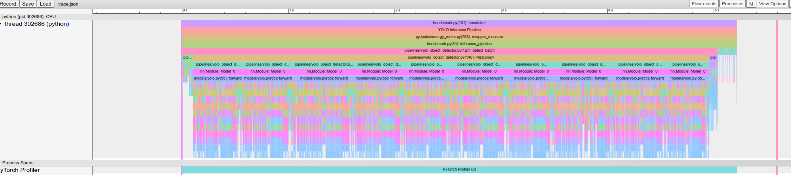
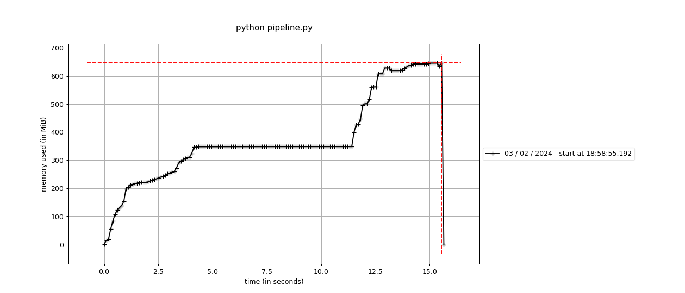
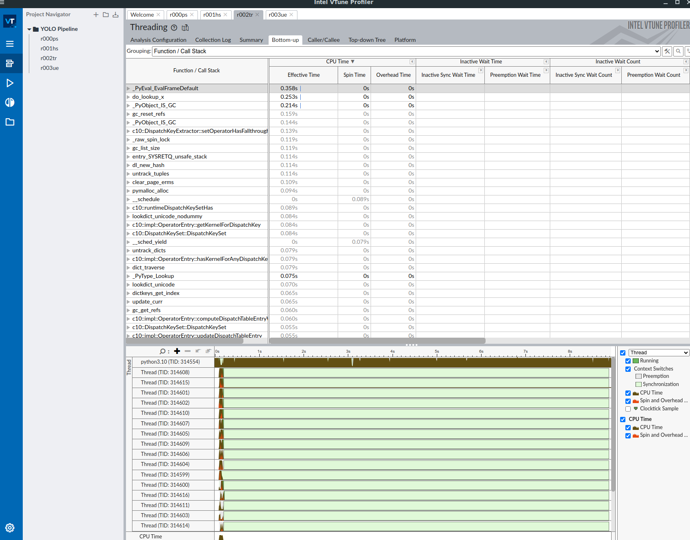
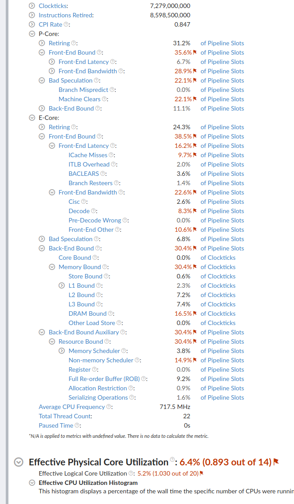

# CPU inference benchmark for object detection

## Model & Dataset

The selected model is [YOLOv7](https://github.com/WongKinYiu/yolov7) from the implemention proposed in PyTorch.   
The pre-trained model has been trained on MS COCO.

Modification to the algorithm:
1. I removed all the other capabilities of the algorithm (tracking, OCR, stream/video, segmentation) to keep only the object detection.
2. I removed all the training part to keep only the inference part.
3. I removed the GPU specific code and pinned the device to CPU wherever possible.
4. I had to create an equivalent to `torchvision.datasets.ImageFolder` as it does not exist in the torchvision version required by this YOLO implementation.
5. I had to write the batch inference method because the implementation offered only sequential inference. However, I did not implement neither a proper vectorization nor concurrent processing.

The selected dataset is a tiny subset of ImageNet available on Kaggle and called [imagenet-mini](https://www.kaggle.com/datasets/ifigotin/imagenetmini-1000).


## Object Detection Pipeline

Structure of the project:
```
/models  # YOLO implementation - !!! not my code at all
/pipelines
    |- yolo_object_detector.py  # Pipeline object responsible for (pre,post)processing, forward and timing
/utils
    |- dataset.py     # General loader for img as PyTorch Dataset + letterbox
    |- detections.py  # Bounding box - !!! not my code (mostly)
    |- general.py     # Preprocessing and postprocessing methods - !!! not my code (mostly)
    |- models.py      # Model loader
benchmark.py          # Execution of the pipeline, metric measurements and postprocessing
```


## Benchmark Framework

The benchmark consists in three steps:

1. Loading a configurable number of images and loading the model.
2. Executing the pipeline over the batch of images. In particular, the mode is warmed up on CPU using PyTorch Profiler.
3. Collecting, processing and exporting the metrics in the `outputs/<run_id>/` folder. 


## Metrics & Artefacts

All the artefacts are saved in `outputs/<run_id>/`. The pictures with the bouding boxes are in `outputs/<run_id>/images`.

### CPU Time:   

Because we are interested in inference on CPU only, a system clock should be OK.

1. For layers, the measurement is done by registering forward hooks on the model hosted by the Pipeline object. Tere 251 layers in the model so the full CSV is exported in `outputs/<run_id>/layer_timer.csv` which can be further explored. However, we compute and display the aggregated time per layer as this tells us where to look for optimization:
```
#### Time spent per layer type:
layer_type
Conv           3.753335
Conv2d         3.022981
BatchNorm2d    0.486310
Detect         0.478222
MaxPool2d      0.304365
SP             0.219757
LeakyReLU      0.219396
Concat         0.175794
MP             0.093428
Upsample       0.044974
```
2. For the pre-processing and post-processing, the measurement is done manually in the Pipeline object. Because I did not have time to implement a proper vectorization and/or threapool for the batch methods, it is OK to measure it that way. I save also the time for the Non-maximum Suppression and the Bounding Box calculation as substep of the postprocessing. The CSV is exported in `outputs/<run_id>/steps_timer.csv`. But as it turns out preprocessing and postprocessing steps are neglectible, the summary only displays `preprocessing`, `forward` and `postprocessing`:
```
#### Time spent per pipeline steps:
                      total count       avg       std       min       max    total %
total_preprocess   0.101738    10  0.010174       0.0  0.010174  0.010174   2.023684
total_forward      4.852746    10  0.485275  0.059022  0.400288  0.578981  96.526841
total_postprocess   0.07287    10  0.007287  0.003465  0.001867  0.012716   1.449475
```
3. As PyTorch Profiler is used, we also export the trace in `outputs/<run_id>/trace.json` that can be explored using `chrome://tracing`:


### Energy:

Another important metric to measure, especially for hardware comparison, is the energy consumption.

I used PyJoules which uses RAPL technology to estimate the CPU and core consumption of the overall benchmark. Because we have a specified number of images during the benchmark, we can easily convert it to inference/W or FLOP/W or MAC/W.

The values are exported in `outputs/<run_id>/energy.csv`.

Example of output:
```
      timestamp                 tag  duration   package_0      core_0
0  1.706986e+09  inference_pipeline  5.212322  79850138.0  32277140.0
```

### RAM

Probably a bit less important in the context of CPU but can still give some important hints on the model's behavior.

```
mprof run python benchmark.py 
mprof plot -o RAM_usage.png --backend agg
```


### Example of full output:

```
(.venv) aquemy@ws:~/projects/benchmark/vision-benchmark$ python benchmark.py 
WARNING:root:pynvml not found you can't use NVIDIA devices
STAGE:2024-02-03 19:38:24 302686:302686 ActivityProfilerController.cpp:294] Completed Stage: Warm Up
STAGE:2024-02-03 19:38:30 302686:302686 ActivityProfilerController.cpp:300] Completed Stage: Collection

#### CPU Time and Call Count:
---------------------------------  ------------  ------------  ------------  ------------  ------------  ------------  
                             Name    Self CPU %      Self CPU   CPU total %     CPU total  CPU time avg    # of Calls  
---------------------------------  ------------  ------------  ------------  ------------  ------------  ------------  
          YOLO Inference Pipeline        20.39%        1.064s       100.00%        5.216s        5.216s             1  
                     aten::conv2d         0.27%      14.105ms        55.26%        2.882s       4.970ms           580  
                aten::convolution         0.43%      22.189ms        54.99%        2.868s       4.945ms           580  
               aten::_convolution         0.57%      29.585ms        54.56%        2.846s       4.907ms           580  
         aten::mkldnn_convolution        53.23%        2.777s        53.99%        2.816s       4.856ms           580  
                 aten::batch_norm         0.20%      10.349ms         6.34%     330.471ms     600.856us           550  
     aten::_batch_norm_impl_index         0.47%      24.269ms         6.14%     320.122ms     582.040us           550  
                 aten::max_pool2d         0.05%       2.381ms         5.60%     291.902ms       4.865ms            60  
    aten::max_pool2d_with_indices         5.55%     289.521ms         5.55%     289.521ms       4.825ms            60  
          aten::native_batch_norm         4.78%     249.501ms         5.52%     288.083ms     523.787us           550  
---------------------------------  ------------  ------------  ------------  ------------  ------------  ------------  
Self CPU time total: 5.216s

ERROR:2024-02-03 19:38:39 302686:302686 CudaDeviceProperties.cpp:26] cudaGetDeviceCount failed with code 100
STAGE:2024-02-03 19:38:40 302686:302686 output_json.cpp:417] Completed Stage: Post Processing

#### Time spent per layer type:
layer_type
Conv           3.753335
Conv2d         3.022981
BatchNorm2d    0.486310
Detect         0.478222
MaxPool2d      0.304365
SP             0.219757
LeakyReLU      0.219396
Concat         0.175794
MP             0.093428
Upsample       0.044974

#### Time spent per pipeline steps:
                      total count       avg       std       min       max    total %
total_preprocess   0.101738    10  0.010174       0.0  0.010174  0.010174   2.023684
total_forward      4.852746    10  0.485275  0.059022  0.400288  0.578981  96.526841
total_postprocess   0.07287    10  0.007287  0.003465  0.001867  0.012716   1.449475

#### Total Energy (in uJ):
      timestamp                 tag  duration   package_0      core_0
0  1.706986e+09  inference_pipeline  5.212322  79850138.0  32277140.0
```

### The missing ones

- **model MACs / FLOPs:** I was not able to get the FLOPS using PAPI because this laptop I have a custom kernel without support for libpfm4 and I did not want to take the risk to recompile my kernel:
```
(.venv) aquemy@ws:~/projects/benchmark/vision-benchmark$ papi_component_avail 
Available components and hardware information.
--------------------------------------------------------------------------------
PAPI version             : 6.0.0.0
Operating system         : Linux 6.5.0-10022-tuxedo
Vendor string and code   : GenuineIntel (1, 0x1)
Model string and code    : 13th Gen Intel(R) Core(TM) i7-13700H (186, 0xba)
CPU revision             : 2.000000
CPUID                    : Family/Model/Stepping 6/186/2, 0x06/0xba/0x02
CPU Max MHz              : 4800
CPU Min MHz              : 400
Total cores              : 20
SMT threads per core     : 2
Cores per socket         : 10
Sockets                  : 1
Cores per NUMA region    : 20
NUMA regions             : 1
Running in a VM          : no
Number Hardware Counters : 0
Max Multiplex Counters   : 384
Fast counter read (rdpmc): yes
--------------------------------------------------------------------------------

Compiled-in components:
Name:   perf_event              Linux perf_event CPU counters
   \-> Disabled: Unknown libpfm4 related error
Name:   perf_event_uncore       Linux perf_event CPU uncore and northbridge
   \-> Disabled: No uncore PMUs or events found

Active components:
```

- A fine grain CPU profiling using VTune. I did not have time to integrate it into the project but I've done a couple of exploration which shows the limtation of the GIL of the vanilla Python implementation.



# Adding a dataset

The pipeline accepts any size of images. The Dataset loader allows for images of different sizes as well.

To add a new dataset, modify the ```utils/dataset.py``` and add an entry to the dictionary `datasets`:
```
datasets = {
    'imagenet-mini': 'imagenet-mini/val'
    'my_dataset': '<path/to/images>
}
```
(It should be a YAML file to make it easier...)

# TODO

- Better configuration of the benchmark suite via YAML files (dataset, config, metrics, etc).
- Integrate `mprof` directly in the benchmark rather than a separate command.
- Integrating VTune directly in the benchmark.
- Improving the benchmark using Cython, CPU pinning, OpenVINO or ONNX.
- Streamlit or Tensorboard to present automatically all the results from a run.
- MLFlow to manage the runs instead of me :()